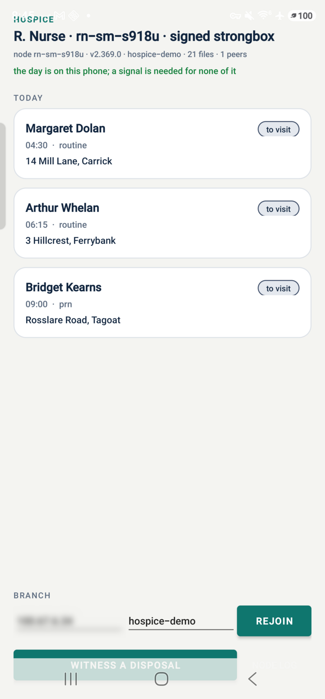
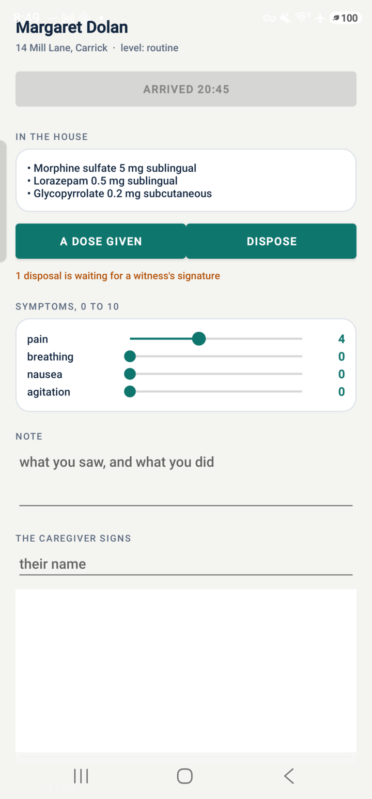
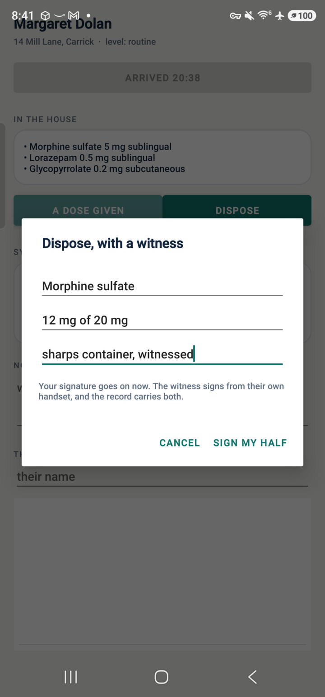
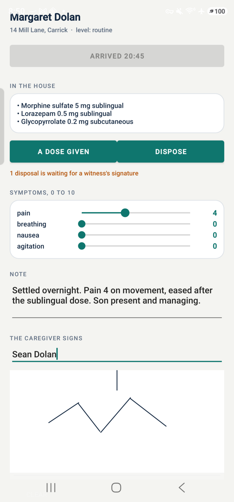
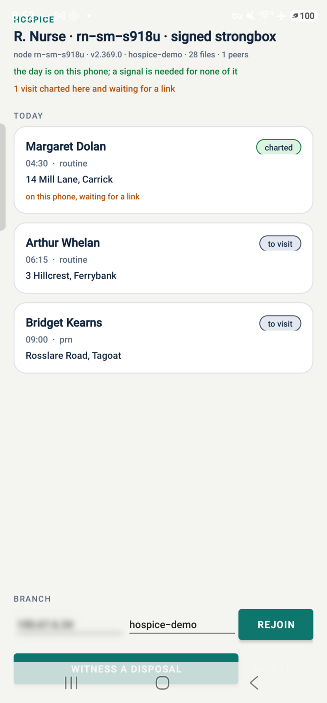

# Hospice nurse — the visit runs on the phone

An Android app for the visiting nurse in the
[multi-state hospice](https://www.unidatum.ie/en/blog/architecture-hospice-care)
architecture. It bundles the unidatum engine and runs a node inside the app,
so the day's visits, the medicine lists and every signature the nurse
collects live on the handset itself.

A hospice nurse drives to a house in a valley, charts a visit that has legal
and billing weight, and drives to the next one. The signal in between is
whatever the road gives them. This app treats that as the normal case: the
whole visit is a set of writes to the copy of the record on the phone, and
the branch learns about them whenever the link comes back.

## What it does

Three things a hospice needs from the field, each done on the handset:

- **The day, held locally.** Patients, visits, medicine lists and the
  verification trail are replicated to the phone before the nurse leaves,
  and every screen reads from the phone's own node.
- **Signed arrival and departure.** The time and the GPS fix, signed by a
  key generated inside the phone's secure element. This is the evidence a
  payer asks for when it audits a visit.
- **A controlled-substance disposal with two signatures.** The nurse signs
  their half on this handset; the witness signs theirs on their own, with
  their own key. Per-field merge puts both halves on one document.

## In action

The run below is on a Galaxy S23 Ultra (Android 16) with unidatum v2.369.0,
against a branch node on a laptop on the same network. The branch address is
blurred out of the screenshots.

### 1. The day is on the phone



The status line is the node inside the app: `rn-sm-s918u`, engine v2.369.0,
library `hospice-demo`, 21 files, 1 peer. `signed strongbox` beside the
nurse's name means the signing key went into the handset's secure element.

Under it, in green, is the line the nurse actually cares about: **the day is
on this phone; a signal is needed for none of it.** The app shows that only
once every collection the day needs is held here, rather than answered by
asking the branch. Times are the nurse's own — the visits carry UTC and the
list renders in the handset's zone.

### 2. Inside the house



Arrive stamps the time and the place and signs both. The claim is the exact
string that gets signed:

```
unidatum-hospice-visit/v1|rn-sm-s918u|v-2026-09-13-1|arrived|-89.367429|30.307361|2026-09-14T01:45:37.172155Z
```

**In the house** is the comfort kit, read from the patient's own record on
the phone. A dose given goes onto `medications` with the drug, the dose, the
route and the time.

The four sliders are the symptom scores a hospice chart carries — pain,
breathing, nausea, agitation, each 0 to 10. They and the note are written to
the visit as the nurse works, so a visit interrupted halfway keeps what was
already charted.

### 3. A disposal, with a witness



Wasting a controlled substance takes two clinicians. The nurse fills in the
drug, the amount and the method, and signs their half:

```
unidatum-hospice-waste/v1|nurse|rn-sm-s918u|v-2026-09-13-1-waste-555950685|Morphine sulfate|12 mg of 20 mg|sharps container, witnessed|2026-09-14T01:45:55.950685Z
```

The record then reads **1 disposal is waiting for a witness's signature** —
on the visit screen and in the day list — until the second signature lands.

The witness signs on their own handset. In this run a second clinician,
`rn-a-quinn`, opened Witness a disposal on another node, saw the open record
and signed it with a key generated on that device. Three minutes later the
phone's copy carried both halves:

| field | written by | at |
|---|---|---|
| `waste_claim`, `waste_signature`, `waste_public_key` | `rn-sm-s918u`, on the phone | 01:45:55 |
| `witness_claim`, `witness_signature`, `witness_public_key` | `rn-a-quinn`, on their own node | 01:48:53 |

One document, two public keys, and neither writer overwrote the other. That
is the per-field merge policy doing its job: the two clinicians touched
different fields of the same record, and the engine kept both.

### 4. The caregiver signs



The family caregiver signs on the glass with a finger. The pad exports a PNG
and the visit carries it inline, 14 KB in this run, beside the caregiver's
name. Closing the visit writes a departure claim signed the same way as the
arrival, and sets the visit to `charted`.

### 5. Charted, and waiting for a link



Amber says what is held here and yet to travel: **1 visit charted here and
waiting for a link.** With the branch reachable the line clears within a sync
interval. With the phone in a valley it stays, and the nurse carries on to
the next house.

## Signatures a reviewer can check

`tools/verify.mjs` rebuilds every claim from the document's own fields and
checks the signature over it. The public key rides on the document, so a
compliance reviewer runs this against any node that holds the collections and
needs no key exchange with the handset.

Against the phone, and against the branch node, in this run:

```
$ node tools/verify.mjs http://<branch>:7485
VERIFIED  v-2026-09-13-1-arrived claim matches its own fields
VERIFIED  v-2026-09-13-1-arrived signature over the claim
VERIFIED  v-2026-09-13-1-left claim matches its own fields
VERIFIED  v-2026-09-13-1-left signature over the claim
VERIFIED  v-2026-09-13-1 clinician signature
VERIFIED  v-2026-09-13-1 carries the caregiver's signature   Sean Dolan, 14386 bytes
VERIFIED  v-2026-09-13-1-waste-555950685 nurse claim matches the document
VERIFIED  v-2026-09-13-1-waste-555950685 nurse signature
VERIFIED  v-2026-09-13-1-waste-555950685 witness claim matches the document
VERIFIED  v-2026-09-13-1-waste-555950685 witness signature
VERIFIED  v-2026-09-13-1-waste-555950685 the two halves are two different keys   rn-sm-s918u and rn-a-quinn

11 verified, 0 failed
```

Rebuilding the claim from the document is what makes signing worth doing. A
signed record cannot be re-pointed at another clinician, another place or
another moment and still verify. Three edits made by another writer on the
branch node, each caught, and each then restored:

| what another writer did to the record | what the verifier said |
|---|---|
| moved the arrival 2 km | claim matches fails; the document reads `-89.350000\|30.320000` where the signed claim reads `-89.367429\|30.307361` |
| replaced the arrival signature with the departure's, a real signature from the right key | signature over the claim fails |
| re-pointed the disposal at a different witness | witness claim matches fails; the signed claim still names `rn-a-quinn` |

Any writer on the collection can still write a row. Only the clinician who
holds the key can sign one.

## What the node did

The engine's own output during the run, with the branch address masked:

```
replicate patients: complete, 1 member(s) fetched — now following
replicate visits: complete, 1 member(s) fetched — now following
replicate medications: complete, 1 member(s) fetched — now following
replicate visit_verification: complete, 1 member(s) fetched — now following
sync <branch>:47810: sent 2, got 0
go-serve: seeding visit_verification.collection to <branch>
go-serve: seeded 2379 byte(s) of visit_verification.collection
go-serve: merged 1 op(s), rejected 0, 1 received, in 10ms
follow medications: 1 new member(s) fetched
go-serve: seeding visits.collection.delta.parquet to <branch>
go-serve: seeded 20636 byte(s) of visits.collection.delta.parquet
```

Reading down: the phone replicated the four collections it needs, pushed its
own commits to the branch, and served the members those commits created when
the branch came for them. `merged 1 op(s), rejected 0` is the witness's
signature arriving from the other node. The 20 KB member is the visit
carrying the caregiver's PNG.

## The nurse's calls (`Nurse.kt`)

Every call below goes to the node inside the app at `http://127.0.0.1:7482`.

| step | call |
|---|---|
| join | `POST /api/sync {host, port: 47810}`, then `POST /api/table/replicate` for `patients`, `visits`, `medications`, `visit_verification` |
| the day | `POST /api/doc/find visits {clinician_id, date}`, then `patients {_id: {$in: […]}}` |
| arrive | `POST /api/doc/put visit_verification {claim, signature, public_key, location}` and `update visits {arrived_at, status}` |
| a dose | `POST /api/doc/put medications {drug, dose, route, given_at, clinician_id}` |
| dispose | `POST /api/doc/put medications {waste_claim, waste_signature, waste_public_key, …}` |
| witness | `POST /api/doc/update medications {_id} $set {witness_claim, witness_signature, witness_public_key}` |
| chart | `POST /api/doc/update visits {_id} $set {symptoms, note, charted_at}` |
| close | `update visits $set {left_at, status: charted, caregiver_name, caregiver_signature, clinician_claim, …}` and a `left` document on `visit_verification` |

Signing happens in `Keys.kt`: a P-256 key generated in the AndroidKeyStore
with StrongBox asked for first, ECDSA over SHA-256, and the public half
published on each document. The private half stays in the secure element —
the app can ask it to sign and can never read it, which holds through a
backup and through a later root.

## What is in the APK

| file in `lib/arm64-v8a/` | what |
|---|---|
| `libunidatum.so` | the engine, the `android/arm64` release archive's `unidatum` |
| `libduckdb.so` | DuckDB's musl arm64 CLI, the engine's reader |
| `libmusl.so` | musl's loader, which runs it |
| `libstdcpp6.so`, `libgccs1.so` | its two libraries, from Alpine |
| `libduckwrap.so` | a shell script the engine gets as `P2PFS_DUCKDB` |

Android runs a native executable an app ships only from the app's own
native-library directory, and the packager takes only `lib*.so` names — hence
the names, and `patchelf` rewriting the DT_NEEDED entries to match, including
the transitive ones (libstdc++ asks for libgcc_s by name).
`tools/fetch-natives.sh` produces all six and needs `patchelf`, `curl`, and
either a local engine build or `gh` access to the release repo. They come to
107 MB and stay out of git; the debug APK is 53 MB.

The node runs as a foreground service (`NodeService`): `init` once into
`filesDir/node` as `rn-<model>`, then
`ui --port 47804 --dht-port 47805 --ui-port 7482 --bind 0.0.0.0 --sql
--no-mdns --sync-every 5 --seed-open`.

## Build and run

```sh
tools/fetch-natives.sh v2.369.0
JAVA_HOME=~/jdk/jdk17 ANDROID_HOME=~/android-sdk ./gradlew assembleDebug
adb install -r app/build/outputs/apk/debug/app-debug.apk
```

Then stand up a branch node with a day on it. The app's status line shows the
node name it chose; pass that as `NURSE` so the visits are addressed to this
handset:

```sh
NURSE=rn-sm-s918u tools/seed-branch.sh ~/hospice-branch
cd ~/hospice-branch && unidatum ui --port 47810 --ui-port 7485 \
  --bind 0.0.0.0 --sql --seed-open --sync-every 5
```

Put that machine's address in the app's **Branch** field and tap **Rejoin**.
Three visits appear. Ports on the phone are 7482 (API, bound on all
interfaces so a laptop on the same network can query the phone's copy), 47804
sync and 47805 DHT.

To play the witness from a laptop, run a second node in the same library,
generate a P-256 key, and update the open disposal with a `witness_claim` of
the shape shown above. `tools/verify.mjs` then reports two different keys on
the one document.

## Three things worth knowing

These came out of building it, and they apply to any app that writes from
several devices into one library.

**Declare the merge policy before the concurrent writes.** `doc merge <coll>`
sets per-field last-write-wins, which is what keeps a nurse's half and a
witness's half on one record. Declared once writing has already happened
concurrently, the collection has forked and the two halves sit on two copies.
`tools/seed-branch.sh` declares it on every collection at creation.

**A node must replicate a collection to hold it.** `find` can be answered by
asking peers, so a query succeeds while the members are still elsewhere;
`count` and `update` want every member local. Replicating each collection up
front is what turns the green line on, and it is the difference between a day
that survives a valley and one that quietly depends on a signal.

**The engine runs one replication at a time.** Asking for four in a row
leaves three unstarted. `Nurse.ensureFollowing` asks for each in turn, comes
back to the ones still outstanding, and stops when nothing is left — and the
10-second poll calls it again, so a collection added later is picked up with
nobody tapping anything.

## Limits

- arm64 only, Android 10 and up. The engine is a static Go binary and DuckDB
  is the musl build.
- One branch and one library, editable in the app. The nurse's identity is
  the node name, which is derived from the handset model; a real deployment
  would bind it to the clinician's login.
- The witness path is driven from a second node. A witness build with its own
  screen is the obvious next piece.
- Location comes from the phone's last known fix, which keeps arrival instant
  indoors. A deployment that needs a fresh fix for every arrival would ask for
  one and wait.
- The signature pad takes the whole of its own area, so a long note is
  scrolled from the left margin.
- The debug build only. A release build needs a signing key, and no ProGuard
  rules are written.
- The demo data is three patients in one branch. Payer and federal interfaces
  sit on the [hospice architecture](https://www.unidatum.ie/en/blog/architecture-hospice-care)
  as branch-side processes, and none of them run here.

## Try the engine

The engine behind this app runs on a laptop, a rack or a handset, and a free
evaluation licence is at [unidatum.ie](https://www.unidatum.ie). Two machines
on one network are enough to watch a write on one appear on the other.
